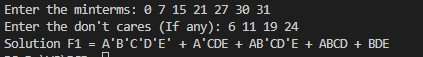
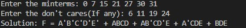

# Boolean Minimization Project

This Python project implements Boolean function minimization using the **Quine-McCluskey algorithm**, **Row Dominance**, **Column Dominance**, and **Petrick's Method**. The project is designed to handle three distinct cases for solving Boolean minimization problems.

---

## Features
- Implements the **Quine-McCluskey algorithm** for generating prime implicants.
- Utilizes **Row Dominance** and **Column Dominance** techniques to simplify the prime implicant chart.
- Incorporates **Petrick's Method** to find solutions to the reduced prime implicant chart.
- Supports three cases of minimization:
  1. Generating **all possible solutions** after a single application of Row and Column Dominance.
  2. Generating **one unique solution** after a single application of Row and Column Dominance.
  3. Iteratively applying Row and Column Dominance until the prime implicant chart stabilizes and generating **one unique solution**.

---

## Cases of Minimization

### **Case 1**: All Possible Solutions
1. Use the Quine-McCluskey algorithm to generate prime implicants.
2. Apply Row Dominance and Column Dominance **once** to simplify the prime implicant chart.
3. Use Petrick's Method to compute **all possible minimal solutions**.

### **Case 2**: One Unique Solution
1. Use the Quine-McCluskey algorithm to generate prime implicants.
2. Apply Row Dominance and Column Dominance **once** to simplify the prime implicant chart.
3. Use Petrick's Method to compute **one unique minimal solution**.

### **Case 3**: Stabilized Chart and Unique Solution
1. Use the Quine-McCluskey algorithm to generate prime implicants.
2. Apply Row Dominance and Column Dominance **repeatedly** until the prime implicant chart stabilizes (no further simplifications possible).
3. Use Petrick's Method to compute **one unique minimal solution**.

---

## Results
This section demonstrates the outputs for the three cases of minimization using example inputs and visual representations.

### **Case 1**: All Possible Solutions
The following image displays all possible solutions after applying Row and Column Dominance once.

### **Case 2**: One Unique Solution
The image below shows the unique solution derived after a single application of Row and Column Dominance.

### **Case 3**: Stabilized Chart and Unique Solution
The image below illustrates the stabilized final minimal solution after repeated applications of Row and Column Dominance.

